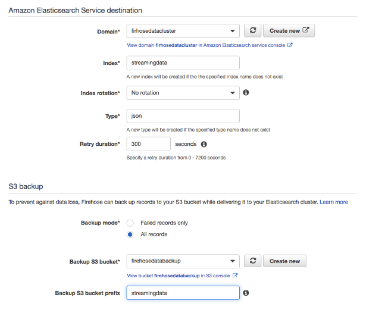

# Customize Elasticsearch index management process when using Kinesis Firehose 

[Amazon Elasticsearch Service (Amazon ES)](https://aws.amazon.com/elasticsearch-service/) is a managed service that makes
it easy to deploy, operate, and scale Elasticsearch clusters in the AWS
Cloud. With Amazon ES, you get direct access to the Elasticsearch APIs;
existing code and applications work seamlessly with the service.
Customers of Amazon ES have workloads that broadly fall into one of the
two categories listed below:

-   **Long-lived index**: Ingest data into one or more Elasticsearch
    indices and create a process to update the indices
    whenever required. Examples for long-lived workloads are website,
    document, and e-commerce search.

-   **Rolling indices**: Continuously streams the data into a set of
    indices, with an indexing period and retention window. These
    retention window for these indices are not fixed but could range
    between 1day to several weeks. Examples for rolling indices
    workloads are log analytics, time-series processing, and
    clickstream analytics.

The user can load [streaming
data](http://aws.amazon.com/streaming-data/) into your Amazon
Elasticsearch Service domain from many different sources. Some sources,
like Amazon Kinesis Data Firehose and Amazon CloudWatch Logs, have
built-in support for Amazon ES. Others, like Amazon S3, Amazon Kinesis
Data Streams, and Amazon DynamoDB, use AWS Lambda functions as event
handlers.

As you would be aware that each Elasticsearch index is split into few
number of shards. We can't easily change the number of primary shards
for an existing index and as general best practices is not to exceed s50
GB storage per shard. For Amazon ES with rolling indices, the management
of index sizes and sharding would be hard, and this blog will help the
user to simplify and customize the Amazon ES index management without
impacting performance of the cluster.

Kinesis Firehose has been one of the main Ingestion mechanisms that
allows you to collect data from streaming sources and index them to AWS
Elasticsearch for performing Text Searches and Analytics using Kibana or
Other Applications.

Kinesis Firehose does allow you to manage an index rotation based on time which could be hourly, daily,
monthly or yearly. In real world customers find the streaming data
volume to be very unpredictable which means having a time-based index
pattern even with best of approximation creates different sized index in
Elasticsearch and hence induces a problematic Data skew issue in AWS
Elasticsearch cluster. As these data sources are running always over
longer periods the data skew magnifies and causes the ES cluster to
perform poorly or even fail.

In this blog, we describe a possible fix for this issue by moving the index
rotation logic from time based to a data size based logic so that if
there is unpredictable traffic on the cluster, Firehose and
Elasticsearch will create indexes with the same size for better performance. 

### Requirements for this setup:

a)  Amazon Elasticsearch Service cluster with Version 5.3/5.5/6.0

b)  A Cronjob or scheduled Lambda or a curator setup for the AWS Elasticsearch cluster

### To get set up, follow these steps:

a)  First create a Kinesis Firehose with Index Rotation set to
    “No Rotation”. We also select an index name which we would later
    create as an alias in Elasticsearch. Set the index name to be
    “streamingdata”

b)  “ES Buffer size” and “ES buffer Interval” are two settings that
    depends on the rate at which data is arriving in Kinesis. An average
    value of these settings should be such that the rate at which bulk
    request are created and they payload size is optimized based on the
    Elasticsearch provisioning. Refer to following [blog](https://aws.amazon.com/blogs/database/send-apache-web-logs-to-amazon-elasticsearch-service-with-kinesis-firehose/ ) for more details. 

c)  Before creating alias and index in AWS Elasticsearch, index template
    should be prepared. This template has the default settings used by
    all the indexes created by Elasticsearch through Firehose stream.
    Apart from mapping information the major setting that has to be
    added in the template is number of primary shads for the index.
    There are a few considerations while setting a value for this:

    a.  Too many shards would case cluster state to be big and master to
        be unstable in long run

    b.  Too less value would compromise search performance and slow down
        write operations

    c.  Ideally aim should be to keep each shard at around 20-30Gb range
        based on the workload and type of instance being used in cluster

> Let’s say for this case we are anticipating around 50-60Gb data per
> day, and we decide that we need to have each index with 2 primary
> shards, if data grows beyond this value then Elasticsearch increases
> the sequence and add more indexes for the same day. Here’s a sample
> template
>
> curl -XPUT 'ES\_ENDPOINT/\_template/firehosedatatemplate?pretty' -H
> 'Content-Type: application/json' -d'
>
> {
>
> "template": "streamingdata-\*",
>
> "settings": {
>
> "number\_of\_shards": 2
>
> }
>
> }'

d)  To Create the index and the Alias name in Elasticsearch, use dynamic
    Index naming. Replace the ELASTICSEARCH\_ENDPOINT with the AWS
    Elasticsearch endpoint. The below call creates an alias with the
    name “streamingdata”. This API call creates an index with a dynamic
    name of streamingdata-(current date)-000001

curl -XPUT
ELASTICSEARCH\_ENDPOINT/%3Cstreamingdata-%7Bnow%2Fd%7D-000001%3E -d '{
"aliases": { "streamingdata": {} } }'

> The purpose of creating a Dynamic Index name is that in case you
> search the data in Elasticsearch or any application using an Index
> pattern “streamingdata-2018.01.19-\*” would allow you to query all
> data that was indexed during that day without you worrying about how
> many underlying indexes were used to store the data

e)  Next, create a curator script that runs every minute. The contents
    of the Script are below

    curl -XPOST 'https://ES\_ENDPOINT/streamingdata/\_rollover?pretty'
    -H 'Content-Type: application/json' -d'{ "conditions": {
    "max\_docs": "100000" } }'

f)  Two-possible ways to automate the run of the above script is using
    Linux Cron or Curator. If using curator, you can automate the
    running of this script by using this action file.

    actions:

    1:

    action: rollover

    options:

    name: streamingdata

    conditions:

    max\_age: 1d

    max\_docs: 1000

    A sample curator configuration would look like this:

    client:

    hosts:

    - ES\_ENDPOINT

    port: 80

    url\_prefix:

    use\_ssl: False

    certificate:

    client\_cert:

    client\_key:

    ssl\_no\_validate: False

    http\_auth:

    timeout: 30

    master\_only: False

    logging:

    loglevel: INFO

    logfile:

    logformat: default

    blacklist: \['elasticsearch', 'urllib3'\]

A Sample run of curator would look like (Assuming both the above
actionfile and configuration file are in same directory):

curator --config ./curatorconfig ./curatoractionfile

With this setup, Amazon ES creates an index daily. If the data exceeds 1
index threshold Amazon ES creates a new index with an incremented
sequence number.

## Some Important Edge Cases using this Architecture:

a)  Since we demonstrated using date based index so, to ensure that all
    date received in a day stays in the index name with that date, the
    cron/curator has to ensure that a forced rollover is performed at
    midnight, otherwise there would be some documents which can appear
    in the next day’s index. This can be done by running a Midnight
    curator command similar to above but with max\_doc value as 1. This
    will force rollover to a new index with new date. The downside of
    this approach is that if the last index of the day was created close
    to midnight, it may not have reached enough data size.

b)  There is a hard limit on number of document a single shard can
    contain and that is 2,147,483,519.

c)  The sequence number at end of index is always increasing because of
    dynamic index name.

d)  Since rollover API call may create new indices and hence shards, it
    may not be immediate and alias would wait for shards to be active
    before switching the index and that could be delay in between this
